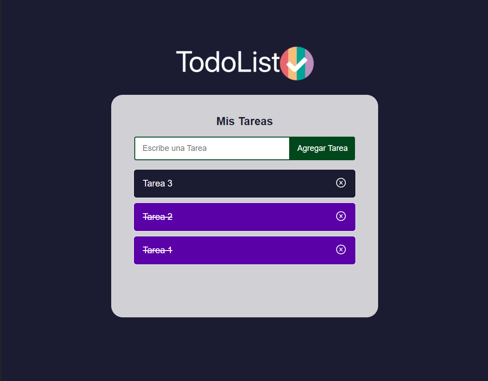

# 📌 Aplicación de Tareas
¡Hola! Esta es una aplicación de tareas interactiva desarrollada con React. Puedes agregar una tarea, eliminarla de la lista y marcarla como completada.

  

## Ejecutar la Aplicación
Para iniciar la aplicación, debes ejecutar el comando `npm start` en el terminal. Si trabajas con Visual Studio Code, puedes abrir el terminal con el atajo de teclado `ctrl + ñ` si tu teclado está en español y con ``ctrl + ` `` si tu teclado está en inglés.

La aplicación se abrirá automáticamente en el navegador configurado por defecto en tu dispositivo y se ejecutará en `localhost:3000`.

## Instalar Módulos
Para instalar los módulos necesarios para la aplicación, debes ejecutar el comando `npm install` en el terminal.